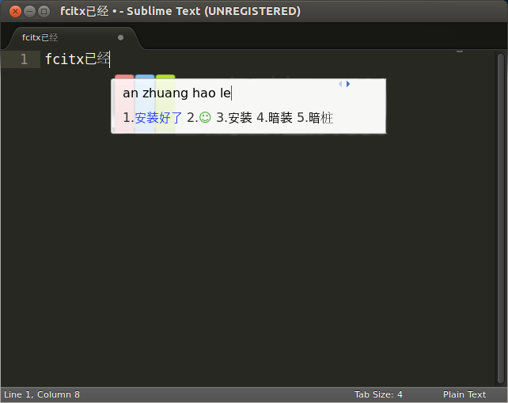

Sublime Text 3 Input Method(Fcitx) Fix [Ubuntu(Debian)]
==========================================================

## Main Purposes

This repo is aimed at doing the following three things:

+ Install Sublime Text 3
+ Install Fcitx Input Method
+ Fix Sublime Text 3's input method problem(Mainly for CJK characters) under Ubuntu(Debian) System

## Updates

+ (new) Fix "Package Preference" cannot open issue. Thanks for @liberize

+ (new) Now, Sublime opened by Icon.desktop can also use Fcitx Input（Dash Icon also work）

+ (new) Fix cursor position not update bug

## **Important Note**

+ **Sublime Text 3 input method fix only works when executing from terminal, such as `subl .`**

## Usage

Steps to use this repo:

+ Update and then upgrade your system to the newest

```bash
sudo apt-get update && sudo apt-get upgrade
```

+ Clone this repo in your local directory :

```bash
git clone https://github.com/lyfeyaj/sublime-text-imfix.git
```

+ Change your current directory to `sublime-text-imfix`:

```bash
cd sublime-text-imfix
```

+ Run the below script :

```bash
./sublime-imfix
```

+ Done! Re-login your X windows. And then you can enjoy using Sublime Text 3 with Fctix Input Method!

## Completion Preview:




```bash
gcc -shared -o libsublime-imfix.so sublime-imfix.c  `pkg-config --libs --cflags gtk+-2.0` -fPIC
```

--------------

## Sublime Text 3 输入法(Fcitx)修复[Ubuntu(Debian)]

## 主要目的

+ 安装 Sublime Text 3
+ 安装 Fcitx 输入法 + 皮肤
+ 修复 Sublime Text 3's 在 Ubuntu(Debian) 系统下的无法输入中文(CJK 字符)输入法的问题

## 更新

+ (new) 修复了 "Package Preference" 无法打开的问题, 感谢 @liberize
+ (new) 通过 Ubuntu 系统图标打开的 Sublime 也支持 Fcitx 输入中文了
+ (new) 修复了输入法不跟随的Bug

## **注意**

+ **这个修复仅当在终端中使用 `subl .` 调用 Sublime Text 的时有效, 具体原因请看源代码[src/subl](https://github.com/lyfeyaj/sublime-text-imfix/blob/master/src/subl)**

## 使用方法

+ 更新并升级系统为最新(较新的系统会解决很多可能出现的问题)

```bash
sudo apt-get update && sudo apt-get upgrade
```

+ 克隆项目到本地 :

```bash
git clone https://github.com/lyfeyaj/sublime-text-imfix.git
```

+ 运行脚本 :

```bash
cd sublime-text-imfix && ./sublime-imfix
```

+ 完成! 重新启动后就可以在 Sublime Text 3 中 使用 Fcitx了! 注意: 皮肤可能需要自己选择 ^_^

## 效果图:


